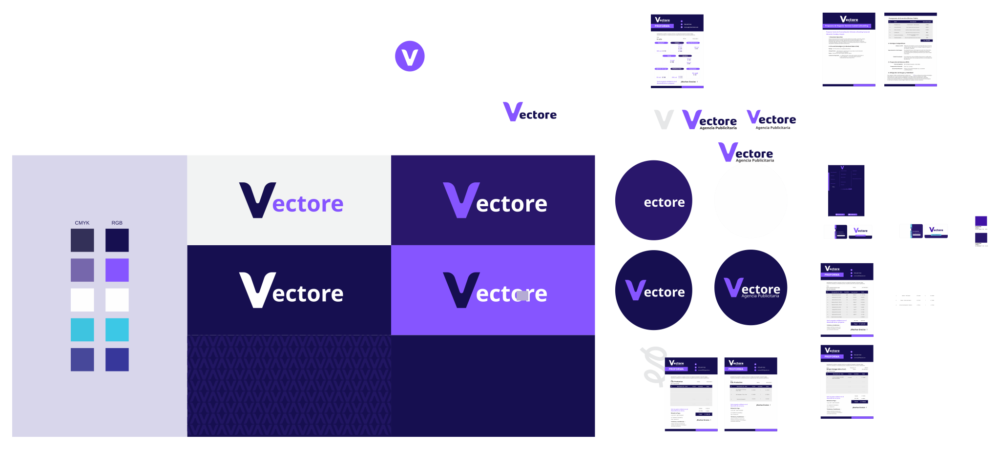

# Vectore — AI-Driven Creative Studio & Advertising Agency

<p align="center">
  
</p>

Full-stack monolith powering **two distinct websites** from a single Express + MongoDB codebase, deployed on **Render**:

| Domain | Audience | Language | Purpose |
|--------|----------|----------|---------|
| `www.agenciavectore.com` | International | English | Premium lead-generation landing — AI, 3D, SaaS |
| `pe.agenciavectore.com` | Peru / Pucallpa | Spanish | E-commerce catalog, payments, events, legal compliance |

---

## 🏗️ Architecture Overview

```
┌────────────────────────────────────────────────┐
│              Render (Node.js)                  │
│                                                │
│  Express Server (server.js)                    │
│  ├── Subdomain Middleware (i18n.js)             │
│  │   ├── pe.* → req.site = 'pe'               │
│  │   └── www.* → req.site = 'global'          │
│  │                                              │
│  ├── API Routes (/api/*)                        │
│  │   ├── auth, products, projects, testimonials│
│  │   ├── events, payments (Culqi), complaints  │
│  │   ├── contact-form (lead qualification)     │
│  │   ├── notifications, upload, software       │
│  │   └── internal-email, users                 │
│  │                                              │
│  ├── Peru Site → index.html (root)             │
│  │   └── checkout, legal pages                 │
│  └── Global Site → views/en/index.html         │
│                                                │
│  MongoDB Atlas ←→ Mongoose ODM                 │
│  Cloudinary ←→ Image/Asset Storage             │
│  Culqi ←→ Payment Processing (PEN)             │
│  Nodemailer ←→ Gmail/Ethereal SMTP             │
└────────────────────────────────────────────────┘
```

---

## 🚀 Features

### Global Site (`www.agenciavectore.com`)
- **Spline 3D hero** with dark/light hana-viewer scenes
- **Dark/Light theme toggle** with localStorage persistence
- **Multi-step smart qualifying form** (service → timeline → budget → contact)
- **Lead scoring engine** — auto-prioritizes by budget + timeline + service type
- **Dynamic portfolio** loaded from API with video support
- **Geo-detection banner** (Cloudflare `cf-ipcountry` → Peru redirect suggestion)
- **ES module JS architecture** — `js/core/app.js` → component imports
- **Premium animations** — scroll reveal, 3D tilt cards, magnetic buttons, parallax orbs, custom cursor

### Peru Site (`pe.agenciavectore.com`)
- **Product catalog** with 7 categories (diseño, impresión, packaging, señalización, vinilo, digital, espacios)
- **Shopping cart** with WhatsApp checkout + Culqi card/Yape payments
- **Giveaway/Events system** — balloon UI, countdown, ticket generation
- **Testimonials carousel** loaded from API
- **Portfolio marquee** with Behance-style modals
- **Libro de Reclamaciones** (Peruvian consumer law compliance)
- **Legal pages** — terms, return policy
- **Image zoom modal** with download protection overlay

### Admin Panel (`admin.html`)
- Full CRUD for: products, portfolio projects, testimonials, events, software assets
- Order management with status tracking
- Lead/Brief inbox with qualification scores
- Notification broadcasting
- User management
- Payment statistics dashboard

---

## 📋 Prerequisites

- **Node.js** v18+
- **MongoDB** (local or MongoDB Atlas)
- **Cloudinary** account (image uploads)
- **Culqi** account (Peru payments — optional for dev)
- **Gmail App Password** (transactional emails — optional for dev)

---

## 🛠️ Quick Start

```bash
# 1. Clone the repo
git clone https://github.com/SalvatoreRamos/Vectore-Agency.git
cd Vectore-Agency

# 2. Install dependencies
npm install

# 3. Configure environment
cp .env.example .env
# Edit .env with your credentials (see SETUP.md for details)

# 4. Seed database (creates admin + 28 products)
npm run seed

# 5. Start development server
npm run dev
```

**Server will be at:** `http://localhost:3000`
- Peru site: `http://localhost:3000/?_site=pe`
- Global site: `http://localhost:3000/`
- Admin panel: `http://localhost:3000/admin.html`
- API health: `http://localhost:3000/api/health`

---

## 🔧 Environment Variables

See [`.env.example`](.env.example) for the full template. Key variables:

| Variable | Description |
|----------|-------------|
| `MONGODB_URI` | MongoDB connection string |
| `JWT_SECRET` | Secret for JWT tokens |
| `ADMIN_EMAIL` / `ADMIN_PASSWORD` | Seeded admin credentials |
| `CLOUDINARY_*` | Cloud image storage config |
| `CULQI_PUBLIC_KEY` / `CULQI_SECRET_KEY` | Payment gateway (PEN) |
| `CULQI_RSA_ID` / `CULQI_RSA_PUBLIC_KEY` | Culqi 3DS encryption |
| `EMAIL_USER` / `EMAIL_PASS` | Gmail SMTP for transactional emails |
| `CONTACT_EMAIL` | Where contact submissions go |
| `GOOGLE_CLIENT_ID` | Google OAuth (optional) |
| `SITE_URL` / `PERU_SITE_URL` | Canonical URLs for hreflang headers |

---

## 📡 API Endpoints

### Authentication (`/api/auth`)
| Method | Path | Auth | Description |
|--------|------|------|-------------|
| POST | `/login` | — | Email/password login → JWT |
| POST | `/register` | — | Create user account |
| POST | `/google` | — | Google OAuth sign-in |
| GET | `/me` | ✅ | Current user profile |
| PUT | `/profile` | ✅ | Update profile |
| PUT | `/change-password` | ✅ | Change password |
| POST | `/forgot-password` | — | Send reset email |
| POST | `/reset-password/:token` | — | Reset with token |

### Products (`/api/products`)
| Method | Path | Auth | Description |
|--------|------|------|-------------|
| GET | `/` | — | List (with filters/pagination) |
| GET | `/:id` | — | Single product |
| GET | `/category/:cat` | — | Filter by category |
| GET | `/featured/list` | — | Featured products |
| POST | `/` | Admin | Create product |
| PUT | `/:id` | Admin | Update product |
| DELETE | `/:id` | Admin | Delete product |

### Payments (`/api/payments`)
| Method | Path | Auth | Description |
|--------|------|------|-------------|
| POST | `/create-charge` | ✅ | Culqi card charge |
| POST | `/create-order` | ✅ | Culqi multipago order |
| POST | `/confirm-order` | ✅ | Confirm Yape/PagoEfectivo |
| GET | `/my-orders` | ✅ | User's orders |
| GET | `/orders/:id` | ✅ | Order detail |
| GET | `/config` | — | Public Culqi keys |
| POST | `/webhook` | — | Culqi webhook handler |
| GET | `/admin/orders` | Admin | All orders |
| PUT | `/admin/orders/:id/status` | Admin | Update order status |
| GET | `/admin/stats` | Admin | Revenue statistics |

### Contact / Leads (`/api/contact`)
| Method | Path | Auth | Description |
|--------|------|------|-------------|
| POST | `/qualify` | — | Smart form submission |
| GET | `/admin/leads` | Admin | All briefs/leads |
| PUT | `/admin/leads/:id` | Admin | Update lead status/notes |

### Other Endpoints
- **Projects** (`/api/projects`) — Portfolio CRUD
- **Testimonials** (`/api/testimonials`) — Testimonial CRUD
- **Events** (`/api/events`) — Giveaway management + participant registration + winner draw
- **Software** (`/api/software`) — Vectore Flow assets CRUD
- **Complaints** (`/api/complaints`) — Libro de Reclamaciones submissions
- **Notifications** (`/api/notifications`) — Push notifications CRUD
- **Upload** (`/api/upload`) — Cloudinary image upload (single/multi)
- **Users** (`/api/users`) — User listing (admin)
- **Internal Email** (`/api/internal`) — Send emails internally

---

## 📁 Project Structure

```
├── server.js                 # Express entry point + routing
├── seed.js                   # Database seeder (admin + 28 products)
├── api-client.js             # Frontend API helper class (VectoreAPI)
├── package.json              # Dependencies & scripts
├── render.yaml               # Render deployment config
│
├── models/                   # Mongoose schemas
│   ├── User.js               # Auth (email/Google, roles, password reset)
│   ├── Product.js            # 7-category product catalog
│   ├── Order.js              # Culqi payments, order lifecycle
│   ├── Lead.js               # Qualifying form leads (auto-scored)
│   ├── Project.js            # Portfolio items (scope: local/global)
│   ├── Testimonial.js        # Client testimonials
│   ├── Event.js              # Giveaways with countdown
│   ├── Participant.js        # Event registrations (phone-unique)
│   ├── Complaint.js          # Consumer complaints (Peru law)
│   ├── Notification.js       # Broadcast/targeted notifications
│   └── SoftwareAsset.js      # Vectore Flow marketing assets
│
├── routes/                   # Express route handlers
│   ├── auth.js               # JWT login/register/Google/reset
│   ├── products.js           # Product CRUD + search
│   ├── payments.js           # Culqi charges, orders, webhooks
│   ├── contact-form.js       # Lead qualification pipeline
│   ├── projects.js           # Portfolio CRUD
│   ├── testimonials.js       # Testimonial CRUD
│   ├── events.js             # Giveaway + participant + draw
│   ├── complaints.js         # Libro de Reclamaciones
│   ├── notifications.js      # Notification CRUD
│   ├── upload.js             # Cloudinary image upload
│   ├── software.js           # Software assets CRUD
│   ├── users.js              # User management
│   └── internal-email.js     # Internal email sending
│
├── middleware/
│   ├── auth.js               # JWT verify, isAdmin, optionalAuth
│   └── i18n.js               # Subdomain detection (pe vs global)
│
├── utils/
│   └── sendEmail.js          # Nodemailer (Gmail/Ethereal fallback)
│
├── views/
│   └── en/
│       └── index.html        # Global premium landing (EN)
│
├── css/                      # Global site design system (modular)
│   ├── design-system.css     # Tokens, custom properties, dark/light
│   ├── global.css            # Layout, navbar, footer, preloader
│   ├── hero.css              # Hero section + Spline + orbs
│   ├── components.css        # Buttons, badges, cards, forms
│   ├── services.css          # Service cards grid
│   ├── portfolio.css         # Horizontal scroll portfolio
│   └── contact.css           # Smart form + success states
│
├── js/
│   ├── core/
│   │   └── app.js            # Global site entry point (ES modules)
│   └── components/
│       ├── animations.js     # Scroll reveal, counters, tilt, magnetic
│       ├── cursor.js         # Custom cursor (ring + dot)
│       ├── forms.js          # Multi-step qualifying form logic
│       ├── spline-viewer.js  # Spline 3D lazy loader
│       └── theme-toggle.js   # Dark/light with system detection
│
├── index.html                # Peru site main page
├── styles.css                # Peru site styles
├── script.js                 # Peru site main JS
├── cart.js                   # Shopping cart logic
├── checkout.html / .js / .css # Checkout flow
├── events.js / .css          # Giveaway balloon + modal
├── admin.html / .js / .css   # Admin dashboard
├── software.html             # Vectore Flow product page
├── cursor.js                 # Peru site cursor
│
├── terminos.html             # Terms & conditions (Peru)
├── politica-devoluciones.html # Return policy (Peru)
├── libro-reclamaciones.html  # Consumer complaints form (Peru)
│
├── public/assets/            # Static assets (images, fonts, 3D, videos)
├── uploads/                  # User-uploaded files
├── robots.txt                # SEO crawler rules
├── sitemap.xml               # Multi-site sitemap with hreflang
├── .env.example              # Environment template
├── .env.production           # Production env template
└── Vectore-*.svg             # Logo assets
```

---

## 🔒 Security

- **Passwords** hashed with bcrypt (10 rounds)
- **JWT** tokens with expiration
- **Helmet** security headers (CSP, COOP, etc.)
- **Rate limiting** — 100 req/15min on `/api/*`
- **CORS** restricted to known origins
- **express-validator** for input validation
- **Multer** with Cloudinary for safe file uploads
- **301 redirects** — `agenciavectore.com` → `www.agenciavectore.com`

---

## 🚀 Deployment

Deployed on **Render** via `render.yaml`:

- **Custom domains:** `www.agenciavectore.com`, `pe.agenciavectore.com`, `agenciavectore.com`
- **Build:** `npm install`
- **Start:** `npm start`
- **Port:** 10000 (Render default)
- **Env vars:** configured in Render dashboard

---

## 👤 Default Admin

After `npm run seed`:
- **Email:** `admin@vectore.com` (or `ADMIN_EMAIL` from `.env`)
- **Password:** `Admin123!` (or `ADMIN_PASSWORD` from `.env`)

---

## 📄 License

ISC
